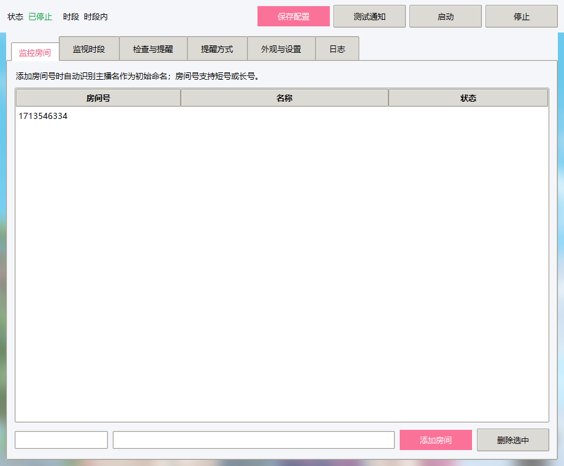
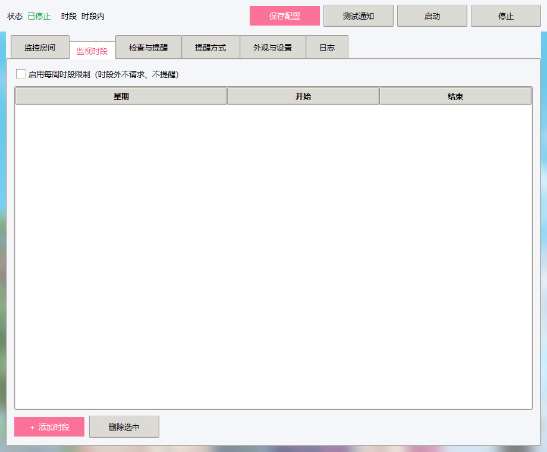
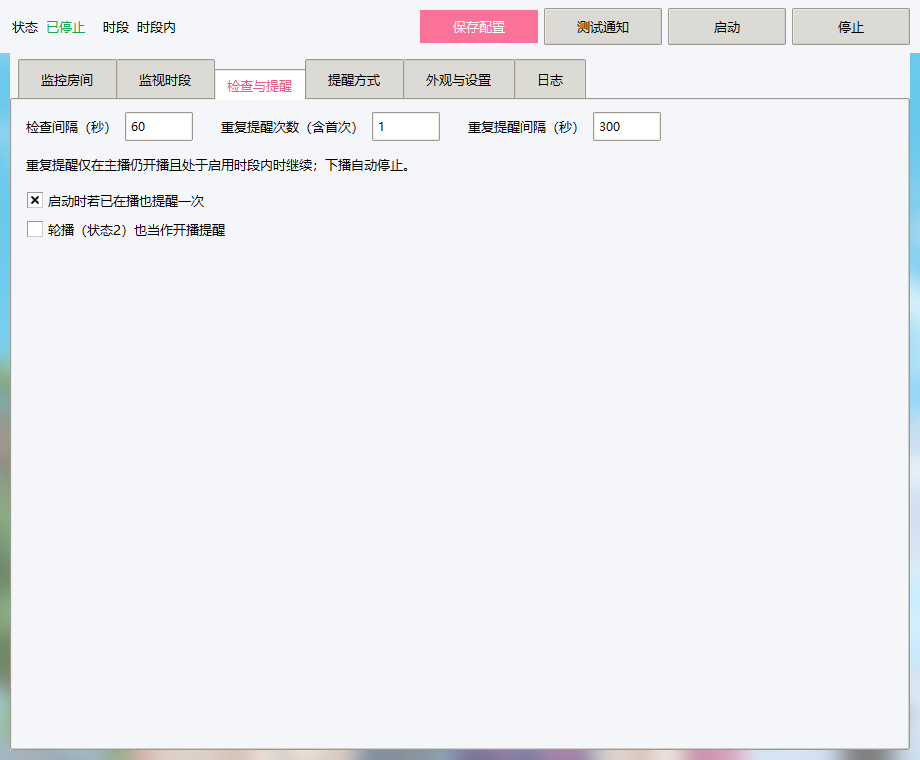
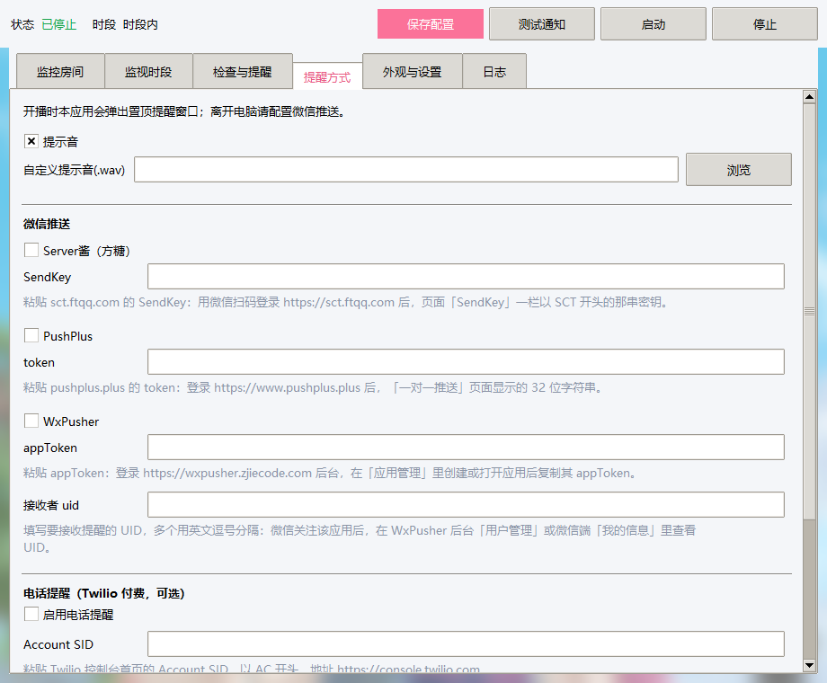
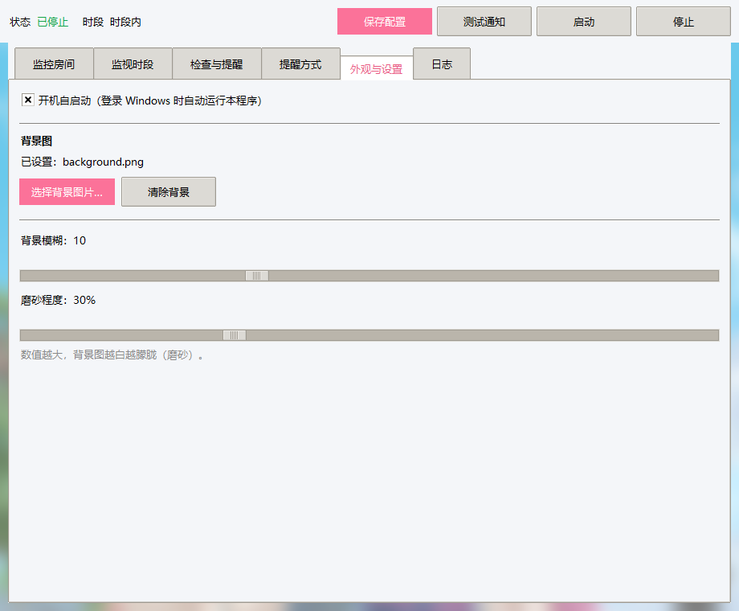
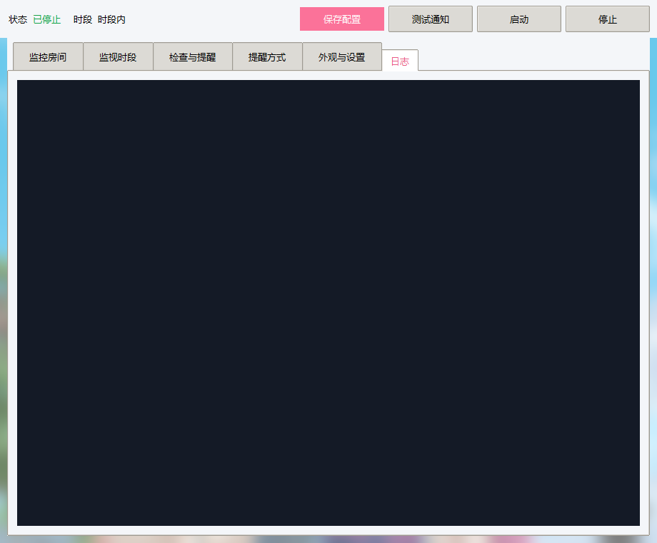

# B站开播监控器 (BiliLiveMonitor)

一款**完全本地化、免安装、低占用**的 Windows 桌面工具，用于实时监控一个或多个 B 站（哔哩哔哩）直播间，在主播开播时第一时间通过**桌面弹窗、提示音、Bark 推送、微信推送、电话提醒**通知你。

> 纯本地应用：不依赖任何网页/服务器，数据只存在你自己的电脑上。无需 Python 环境即可运行（提供单文件 exe）。

---

还在为错过深夜无预告直播而懊恼吗？

还在因liver的周表是厕纸 猜不准开播时间而愤怒吗？

还在为不能当一个合格的考子奔赴每场直播而羞愧吗？

不管你是谁的考子，如果你有类似的烦恼请试试BiliLiveMonitor，考子help考子，让你成为一个合格的考子

## ✨ 核心功能

- 🎯 **多直播间监控**：同时监控多个房间号，自动识别主播名。
- 📅 **每周时段限制**：按星期几 + 时间段（HH:MM）自定义监控时段，支持跨零点（如 23:00–01:00）。
- ⏱️ **可调检查间隔**：自定义轮询间隔（秒），兼顾实时性与低占用。
- 🔁 **重复提醒**：开播后按设定次数与间隔重复提醒，直到下播或超出时段。
- 🔔 **多种通知方式**：
  - 桌面置顶弹窗（任何情况下都显示在最上层）
  - 提示音（支持自定义 `.wav`）
  - Bark 推送：支持官方服务和自建 bark-server
  - 微信推送：Server酱 / PushPlus / WxPusher
  - 电话提醒：Twilio（付费，可选）
- 🎨 **美化界面**：自定义背景图 + 背景模糊 + 磨砂效果。
- 📌 **系统托盘后台运行**：点击关闭窗口后自动收进托盘继续监控。
- 🚀 **开机自启动**：登录 Windows 时自动运行（可选）。
- 🔒 **隐私友好**：仅做"开播状态"查询与提醒，不下载、不录制直播内容。

---

## 🖼️ 界面截图

### 监控房间


### 监视时段


### 检查与提醒


### 提醒方式


### 外观与设置


### 日志


---

## 🚀 快速开始

### 方式一：直接运行 exe（推荐，免 Python）

1. 到本仓库的 [Releases](releases) 页面，下载最新的 `BiliLiveMonitor.exe`（或 `BiliLiveMonitor.zip` 解压）。
2. 双击 `BiliLiveMonitor.exe` 即可运行（无需安装）。
3. 首次运行会自动生成 `config.json` 配置文件。

> 💡 建议把 exe 单独放进一个文件夹，程序会在其旁边生成 `config.json` 和 `data\`（背景图）。

### 方式二：安装包 Setup.exe（带安装向导）

1. 下载 `BiliLiveMonitor-Setup-v1.0.0.exe`。
2. 双击运行，按向导安装（按用户安装、**无需管理员权限**）。
3. 自动创建开始菜单快捷方式，可选桌面快捷方式；卸载可在开始菜单或「设置 → 应用」中完成。

### 方式三：从源码运行（需 Python 3.8+ 及 tkinter）

```powershell
# 1. 下载依赖到 libs\（Pillow / pystray / PyInstaller）
python _fetch_deps.py

# 2. 运行
$env:PYTHONPATH = "$PWD\libs"
python bili_monitor.py
```

---

## 📖 详细使用说明

### 1. 监控房间

- 输入房间号，点击「添加房间」。房间号来自直播间网址 `live.bilibili.com/数字`（支持短号或长号）。
- 添加时自动识别主播名作为初始名称，可手动改名。
- 「删除选中」可移除不再监控的房间。

### 2. 监视时段

- 勾选「启用每周时段限制」后，仅在指定时段内请求和提醒。
- 「＋ 添加时段」按 **星期（1=周一 … 7=周日）+ 开始/结束时间** 添加规则。
- 支持跨零点（结束时间 < 开始时间即视为跨天）。

### 3. 检查与提醒

| 选项 | 说明 |
|---|---|
| 检查间隔（秒） | 多久查询一次直播间状态 |
| 重复提醒次数 | 开播后的提醒总次数（含首次） |
| 重复提醒间隔（秒） | 两次重复提醒之间的间隔 |
| 启动时若已在播也提醒一次 | 打开程序时若主播已在播，立即提醒 |
| 轮播（状态2）也当作开播提醒 | 是否把"轮播"状态也视作开播 |

### 4. 提醒方式

- **提示音**：开播时播放系统提示音；可自定义 `.wav` 文件。
- **Bark 推送（iOS）**：
  1. iPhone 安装 Bark。
  2. 打开 Bark App，首页会显示推送地址。
  3. 复制其中的 Device Key。
  4. 在本应用「提醒方式 → Bark 推送」勾选「启用 Bark 推送」。
  5. Server URL 默认 `https://api.day.app`；使用自建 bark-server 时填写自己的地址，例如 `https://bark.example.com`。
  6. 填入 Device Key，保存配置，点击「测试通知」。
  7. 收到开播提醒后点击 Bark 通知，可以直接打开对应 B 站直播间。
- **微信推送**（离开电脑时用）：
  - **Server酱（方糖）**：登录 [sct.ftqq.com](https://sct.ftqq.com)，复制页面「SendKey」一栏以 `SCT` 开头的密钥。
  - **PushPlus**：登录 [www.pushplus.plus](https://www.pushplus.plus)，复制「一对一推送」页面的 32 位 `token`。
  - **WxPusher**：登录 [wxpusher.zjiecode.com](https://wxpusher.zjiecode.com)，在「应用管理」里复制 `appToken`；微信关注该应用后，在「用户管理」或微信端「我的信息」查看接收者 `uid`（多个用英文逗号分隔）。
- **电话提醒（Twilio 付费，可选）**：注册 [twilio.com](https://www.twilio.com) 后填写：
  - `Account SID`：控制台首页，`AC` 开头
  - `Auth Token`：与 SID 同页，点「显示」复制
  - `主叫号码 From`：Twilio 分配给你的号码，E.164 格式（如 `+12345678901`）
  - `接收手机号 To`：你的手机号，E.164 格式（如 `+8613800138000`）

### 5. 外观与设置

- **开机自启动**：勾选后登录 Windows 自动运行。
- **背景图**：选择本地图片作为界面背景（自动保存到 `data\`）。
- **背景模糊**：背景图高斯模糊程度（0–30）。
- **磨砂程度**：背景图向白色混合的比例（0–100），越大越白越朦胧。

### 6. 日志

- 实时显示查询、提醒、推送等运行日志，便于排查问题。

---

## 🛠️ 从源码重新打包 exe

改了代码后重新打包单文件 exe：

```powershell
$env:PYTHONPATH = "$PWD\libs"
python -m PyInstaller --noconfirm --clean --onefile --windowed --name BiliLiveMonitor --paths "$PWD\libs" --collect-submodules pystray --hidden-import pystray._win32 bili_monitor.py
```

产物在 `dist\BiliLiveMonitor.exe`。若 `libs\` 缺失，先运行 `python _fetch_deps.py` 手动下载依赖。

**生成 Windows 安装包（Setup.exe）**：安装 [Inno Setup 6](https://jrsoftware.org/isinfo.php) 后运行：

```powershell
.\build-installer.ps1
```

脚本会自动定位/安装 Inno Setup 并编译 `installer.iss`，产物在 `installer\BiliLiveMonitor-Setup-v1.0.0.exe`。

---

## 🛡️ Windows 安全拦截说明（重要）

本程序是**开源、未做代码签名**的 exe（代码签名证书需付费购买），因此从 GitHub 下载后 Windows 会提示「无法验证发布者」。按你的系统版本处理：

- **Windows 10 / SmartScreen（蓝色提示框）**：点「更多信息」→「仍要运行」即可。
- **Windows 11 智能应用控制（Smart App Control）**：会直接拦截且无「仍要运行」选项。若你信任本程序，可临时关闭：
  1. 打开「Windows 安全中心」→「应用和浏览器控制」→「智能应用控制设置」。
  2. 选择「关闭」。
  > ⚠️ 该开关**一旦关闭无法再开启**（除非重置/重装系统），请自行权衡；这是 Windows 对"无签名新软件"的通用拦截，并非本程序有风险。
- **解除单个文件锁定**（对 SmartScreen 有效）：右键 exe →「属性」→ 勾选「解除锁定」→ 确定。

> 想彻底消除提示：需用代码签名证书签名（收费），或用 [SignPath](https://signpath.org) 为开源项目申请**免费签名**——本仓库已备好接入脚本与工作流，详见 [SIGNPATH.md](SIGNPATH.md)。本仓库源码完全公开，任何有疑虑的人都可以**从源码自行打包运行**，效果完全一致。

---

## ❓ 常见问题

- **关闭窗口后程序还在运行？** 这是设计如此——关闭窗口会收进系统托盘继续监控，右键托盘图标可退出。
- **微信收不到推送？** 请确认勾选了对应渠道、密钥/uid 填写正确，并查看「日志」标签页的推送结果。
- **Bark 收不到通知？** 请确认已勾选「启用 Bark 推送」、Device Key 和 Server URL 填写正确、Bark App 已允许通知、iOS 已开启 Bark 通知权限，并查看日志中是否出现「Bark 推送成功」。若使用自建 Bark Server，请确认当前电脑能访问该地址。
- **被 Windows 拦截 / 误报？** 见上方「Windows 安全拦截说明」。单文件 exe 由 PyInstaller 打包且未签名，属正常现象；源码公开可自行打包。
- **技术说明**：基于 B 站公开接口查询开播状态，接口若调整可能需小幅更新（已内置单房间接口兜底）。

---

## 📦 项目结构

```
bili_monitor.py        主程序（纯 tkinter，无 Web 依赖）
config.example.json    配置示例
_fetch_deps.py         下载依赖到 libs\（打包用）
build.ps1              从源码打包单文件 exe
installer.iss          Inno Setup 安装脚本
build-installer.ps1    一键生成 Setup.exe 安装包
assets\app.ico         应用图标
docs\images\           界面截图
libs\                  运行/打包依赖（首次运行 _fetch_deps.py 生成）
```

## 📄 许可证

[MIT](LICENSE)

代码签名：Free code signing provided by [SignPath.io](https://signpath.org), certificate by SignPath Foundation（详见 [SIGNPATH.md](SIGNPATH.md)）。
